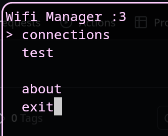
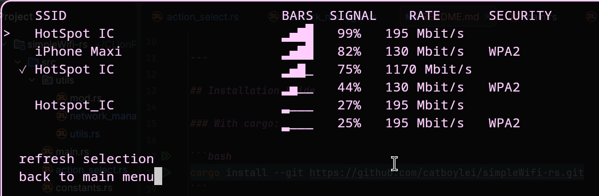

# simpleWifi-rs 

---

Quick rust CLI tool designed to be a simpler and prettier alternative to nmtui.
The point is not to make a powerful complex network manager, but simply to give a simple convenient alternative
to nmcli/nmtui for daily use.
This binary is essentially a rust wrapper with a simple tui over nmcli, to make its functions easier to
use as a daily wifi manager.

--- 

## Installation Guide

### With cargo:

```bash
cargo install --git https://github.com/catboylei/simpleWifi-rs.git
```

### Precompiled:

Download the compiled binary from [Releases](https://github.com/catboylei/simpleWifi-rs/releases) and move it
to a folder in your ```$PATH``` (usually ```/bin/```) (or just run the binary directly)

## Features

Simple main menu, for now only with exit and connections


Connection menu, fetches detected wifis and lets you manually rescan\
you may select any wifi network displayed there to connect/disconnect to it
